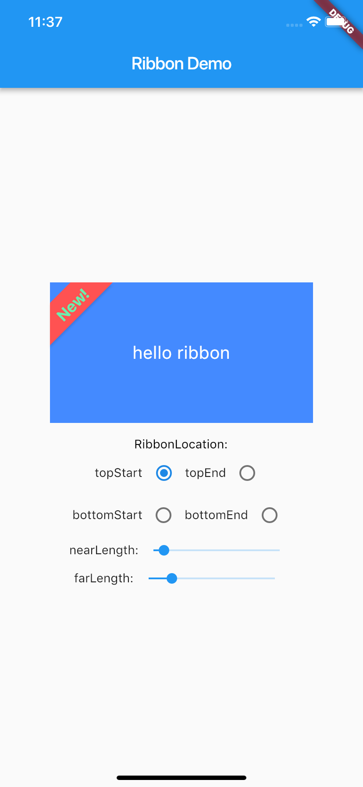

# ribbon

A Ribbon decoration on a widget.

use a Ribbon to decorate a Widget such as container,card...etc.

no clip apply to ribbon title,so check the title length

Installing:

In your pubspec.yaml

dependencies:

ribbon: ^0.0.1
  
Example Usage:

import 'package:ribbon/ribbon.dart';

Ribbon(

nearLength: nearLength,

farLength: farLength,

title: 'New!',

titleStyle: TextStyle(

color: Colors.greenAccent,

fontSize: 18,

fontWeight: FontWeight.bold),

color: Colors.redAccent,

location: location,

child: )

## Getting Started

This project is a starting point for a Dart
[package](https://flutter.io/developing-packages/),
a library module containing code that can be shared easily across
multiple Flutter or Dart projects.

For help getting started with Flutter, view our 
[online documentation](https://flutter.io/docs), which offers tutorials, 
samples, guidance on mobile development, and a full API reference.
